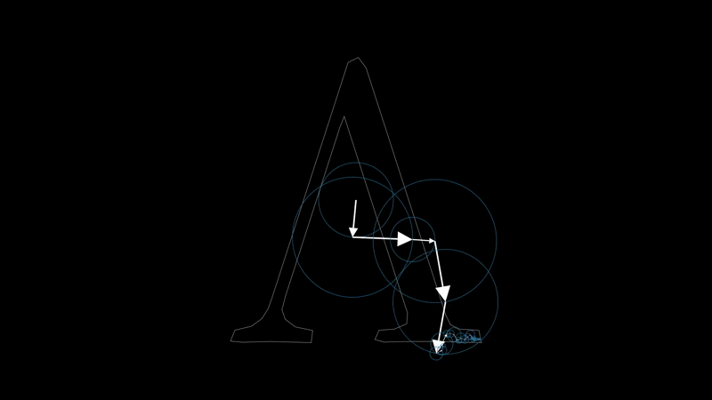
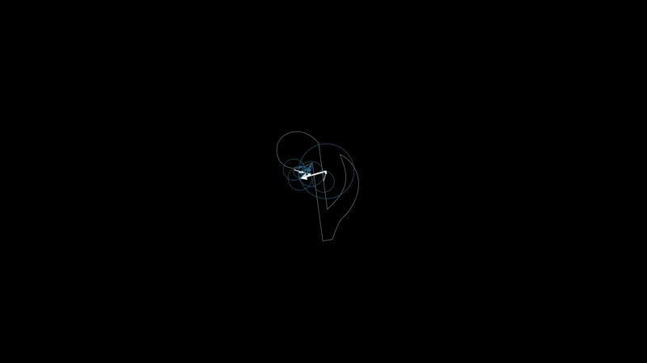

# Fourier Cycles

- It is the first time I use Manim 
- The Notebook contains some basic Examples of Scenes

### The Project
- Inspired By [3b1b Video about Fourier Series](https://youtu.be/r6sGWTCMz2k)
> Only supports Latex Letters now.  
> I will add support to .svg and perhaps .png too.

### Gallery

## Latex

## svg 

Source          |  Rendered gif
:------------------:|:-------------------------:
  |  